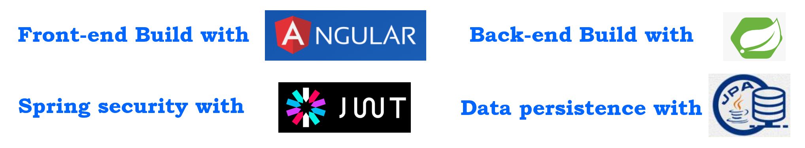
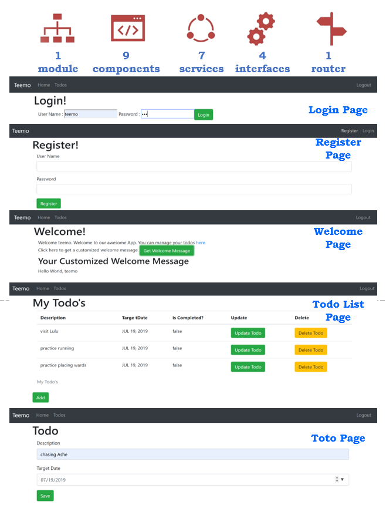
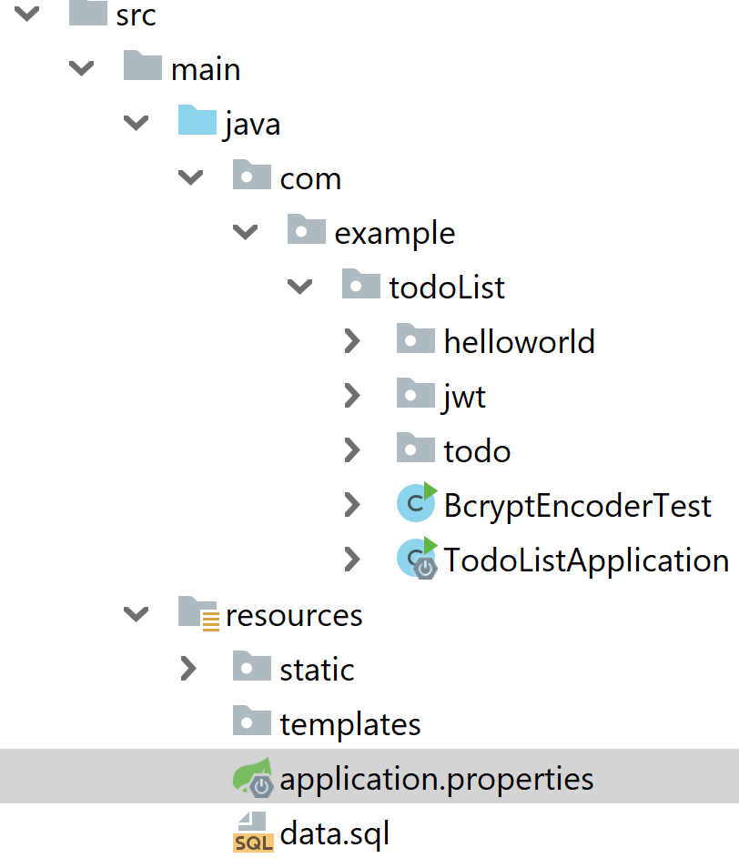

# todo-list-full-stack-angular-springboot

**A full stack project using *Angular* and *SpringBoot*.**

#
If you are also interested in Angular and SpringBoot like me, just don't miss this project. You can [find more about this project, Angular, Spring, SpringBoot](https://tongshi049.github.io/2019/05/15/todoList/) in my blog.

#

## Overview

1. Use **Angular** to build **front-end**.
2. Use **SpringBoot** to build a **RESTful** back-end service.
3. Connect **Angular Frontend** to **Spring Boot RESTful Services**.
4. Connect **Spring Security** with **JWT**.
5. Connect **REST API** With **JPA** and **Hibernate**.
#

## Project Snapshot

1. **Project Conclustion**:
<div>
  
</div>
<br> 

2. **App Pages**:
<div>
  
</div>
<br> 

#

## Getting Started

- Clone the project 
```
git clone  https://github.com/tongshi049/todo-list-full-stack-angular-springboot.git
```
- Go the front-end folder (i.e. `todo-frontend`) and install dependencies
```
cd todo-frontend
npm install
``` 
- Launch development server, and open `localhost:4200` in your browser
```
ng serve 
```
- Go to the back-end folder (i.e. `todo-backend`) and import it as a maven project in `eclipse` or `IntelliJ IDEA` and start the SpringBoot.
```
cd ../todo-backend
```

#

## Project Structure

Front-End: 

```
dist/                        compiled version
e2e/                         end-to-end tests
src/                         project source code
|- app/                      app components 
|  |- error/                 error component (shared component)
|  |- footer/                error component (shared component)
|  |- menu/                  navigator tabs component (shared component)
|  |- login/                 login component
|  |- logout/                logout component
|  |- regitster/             register component
|  |- welcome/               welcome component
|  |- list-todos/            todo list component (show todo list and enable CRUD todo functions)
|  |- list-todos/            todo component (show a todo and enable creating and updating a todo)
|  |- service/
|  |  |- data/
|  |  |  |- todo-data.service.*         call back-end and deal with todo data
|  |  |  |- user-data.service.*         call back-end and deal with user data
|  |  |  |- welcome-data.service.*      call back-end and deal with welcome data
|  |  |- http/
|  |  |  |- http-intercepter-*.*        an Http interceptor adding Authentication in header
|  |  |- basic-authentication.service.* execute basic auth or JWT auth
|  |  |- register-service.service.*     register service
|  |  |- route-guard.service.*          a router guard service (implement
|  |  +- ...
|  |- app.component.*        app root component 
|  |- app.module.ts          app root module definition
|  |- app-routing.module.ts  app routes
|  |- app.contants.ts        global variables
|- assets/                   app assets (images, fonts, sounds...)
|- environments/             values for various build environments
|- index.html                html entry point
|- styles.css                global styles
|- main.ts                   app entry point
|- polyfills.ts              polyfills needed by Angular
|- angular.json              config of Angular
|- package.json              npm packages
|- tslint.json               config of typescript
|- ...                       addtional files
```

Back-End:
<div>
  
</div>
<br> 


#

## Code Scaffolding

Front-end tasks are mostly based on `angular-cli`tool. Use `ng help` or check the [Angular-CLI](https://cli.angular.io/).

Modify the data in database using sql statements in `data.sql`. 

#

### devDependencies

Front-End:
- "@angular-devkit/build-angular": "~0.13.0",
- "@angular/cli": "~7.3.5",
- "karma": "~4.0.0",
- "tslint": "~5.11.0"
- "typescript": "~3.2.2"

Back-End:
version: 2.2.0 BUILD_SNAPSHOT
- spring-boot-starter-web
- spring-boot-starter-data-jpa
- spring-boot-starter-test
- spring-boot-starter-security
- spring-boot-devtools
- h2
- jjwt: 0.9.1

#

### Libraries

- [Angular](https://angular.io/).
- [typescript](https://www.typescriptlang.org/).
- [Spring Boot](https://spring.io/projects/spring-boot).
- [JWT](https://jwt.io/).
- [JPA](https://spring.io/projects/spring-data-jpa).
- [Spring Security](https://spring.io/projects/spring-security).